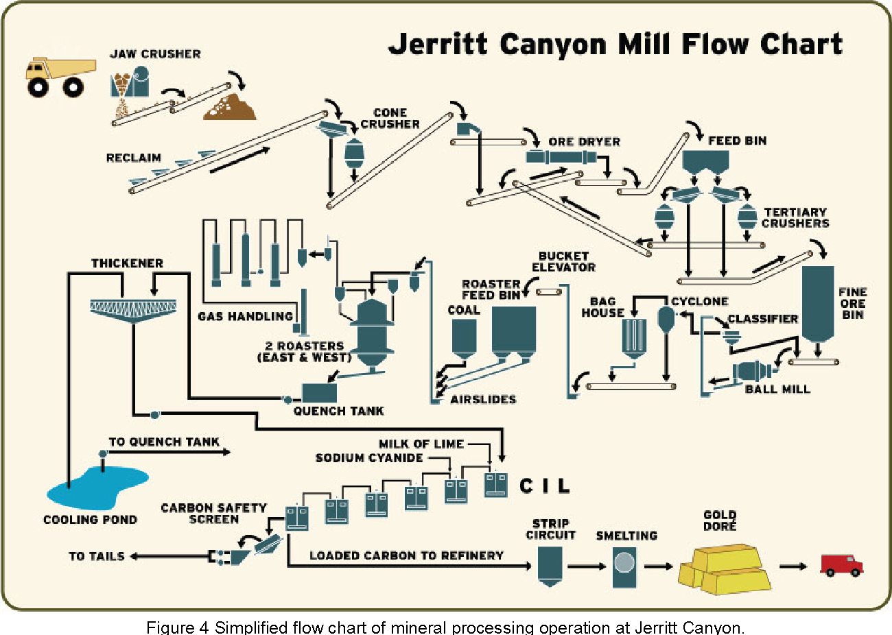

# Gold Recovery Prediction Model

## Project Overview
This project involves building a machine learning model to predict the amount of gold recovered from gold ore. The model aims to optimize production processes and eliminate unprofitable parameters for Zyfra, a company specializing in efficiency solutions for heavy industry.

## Objective

Primary Goal: Develop a model that accurately predicts two key metrics:
- Rougher Concentrate Recovery (rougher.output.recovery)
- Final Concentrate Recovery (final.output.recovery)

Secondary Goal: Evaluate the model's performance using the symmetric Mean Absolute Percentage Error (sMAPE) and ensure it generalizes well on unseen data.

## Data Source
The data is provided in three CSV files:

- gold_recovery_train.csv: Training dataset
- gold_recovery_test.csv: Test dataset
- gold_recovery_full.csv: Complete dataset containing both training and test data

Each file contains features related to the stages of gold recovery from ore, including the flotation process (rougher) and subsequent purification stages.

## Tools and Libraries
- Pandas: For data manipulation and preprocessing.
- Matplotlib: For data visualization.
- Scikit-learn: For model training, evaluation, and cross-validation.

## Project Workflow

1. Data Preparation
- Data Loading: Loaded the data from the provided CSV files into Pandas DataFrames.
- Recovery Calculation: Verified the accuracy of the recovery values in the training dataset by recalculating them and comparing them to the provided values. The low MAE confirmed the accuracy of the recovery calculations.
- Feature Engineering: Prepared the data by handling missing values, removing unnecessary columns, and ensuring the dataset was clean and ready for modeling.
  
2. Exploratory Data Analysis (EDA)
- Metal Concentrations: Analyzed how the concentrations of gold (Au), silver (Ag), and lead (Pb) change across different stages of the purification process. Noted that gold concentration increases in the final output,  while silver decreases, and lead remains relatively stable.
- Particle Size Distribution: Compared the feed particle size distributions between the training and test datasets to ensure they were consistent, which is crucial for accurate model evaluation.
- Total Concentration Analysis: Examined the total concentrations of all substances at different stages and identified and removed anomalies from the data to ensure the integrity of the model.
  
3. Model Development
- Model Selection: Tested three different models—Linear Regression, Decision Tree, and Random Forest—using cross-validation to evaluate their performance based on sMAPE.
- Cross-Validation: Implemented cross-validation to ensure that the model's performance was consistent across different subsets of the data.
  
Final Model: Selected the Random Forest model as the best performer, based on its ability to accurately predict both rougher and final concentrate recovery.

4. Model Evaluation

- Testing on Unseen Data: Evaluated the Random Forest model on the test dataset to validate its performance on unseen data.
- sMAPE Calculation: Calculated the sMAPE for both rougher and final recovery predictions, with a final combined sMAPE of 11.36%.

## Conclusion
- Final sMAPE: The model achieved a final sMAPE of 11.36%, indicating a strong performance in predicting gold recovery. This means that on average, the model's predictions are off by 11.36%.
- Model Choice: The Random Forest model was chosen as the best model for this task due to its superior performance in predicting both rougher and final recovery stages.
- The successful development of this model enables Zyfra to optimize the gold extraction process, reduce waste, and increase efficiency in their operations.

